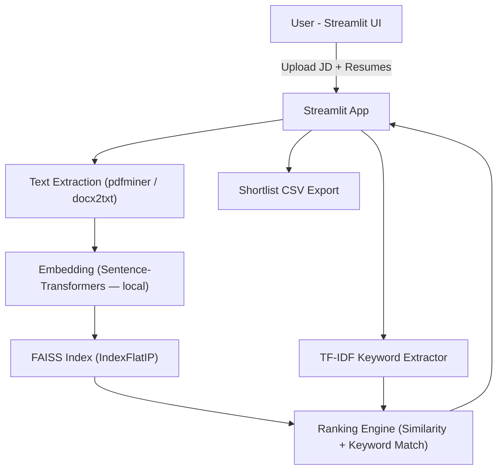

````markdown
# Resume Screening Agent

[](https://www.python.org/)
[](https://streamlit.io/)
[](LICENSE)

---

## Overview
The **Resume Screening Agent** ranks candidate resumes against a Job Description (JD) using **local embeddings** and **keyword matching** — no paid APIs required.

Ideal for:
- Cost-free demos
- Privacy-conscious deployments
- Quick AI prototyping

---

## Features
- Upload **Job Description** (TXT / PDF / DOCX)
- Upload multiple **resumes** (TXT / PDF / DOCX)
- **Semantic ranking** using local Sentence-Transformers embeddings
- **Keyword extraction** from JD using TF-IDF
- **Rule-based explanations**: matched/missing keywords, experience, seniority
- **Export ranked shortlist** as CSV
- Simple **Streamlit UI**, fully local, no API keys

---

## Tech Stack
- **UI:** Streamlit
- **Embeddings:** Sentence-Transformers (`all-MiniLM-L6-v2`)
- **Vector search:** FAISS (IndexFlatIP)
- **Keyword extraction:** scikit-learn TF-IDF
- **File parsing:** pdfminer, docx2txt

---

## Screenshots

**Upload Job Description & Resumes**  


**Ranked Candidates with Explanations**  


*Replace these URLs with real screenshots or GIFs of your app.*

---

## Setup & Run

```bash
# Clone repository
git clone <your-repo-url>
cd resume-screening-agent

# Create virtual environment
python -m venv venv
# macOS/Linux
source venv/bin/activate
# Windows
venv\Scripts\activate

# Install dependencies
pip install -r requirements.txt

# Run Streamlit app
streamlit run app/main.py
````

**Demo Steps:**

1. Paste or upload a **Job Description** (`sample_data/sample_job_desc.txt`)
2. Upload **sample resumes** (`sample_data/resumes/`)
3. Wait for ranking; click **Explain** for candidate insights
4. Download the **CSV shortlist**

---

## Limitations

* PDF parsing may fail for **scanned/image-only PDFs**; use OCR externally
* **Explanations** are rule-based (TF-IDF + regex), suitable for demos but less flexible than LLMs
* First run downloads the embedding model (~50–200MB); subsequent runs are faster

---

## Potential Improvements

* Add **OCR fallback** (Tesseract) for scanned resumes
* Implement **resume anonymization** to reduce bias
* Integrate a **labeled dataset** to tune ranking weights
* Optionally, add a **local LLM** for richer explanations

---

## Architecture



**Description:**

* **Embeddings** capture semantic similarity between JD and resumes
* **FAISS** provides fast similarity search
* **TF-IDF** extracts key JD terms for interpretable matching
* **Ranking Engine** combines similarity + keyword coverage
* **Streamlit UI** displays rankings, explanations, and CSV export

---

## Quick Tips

* Use **anonymized resumes** for fair evaluation
* Reduce `max_features` in TF-IDF or `top_k` to speed up ranking on slower machines
* Demonstrates **cost-effective, privacy-conscious AI** in hackathons or prototypes

---

## License

MIT License — see [LICENSE](LICENSE)

---