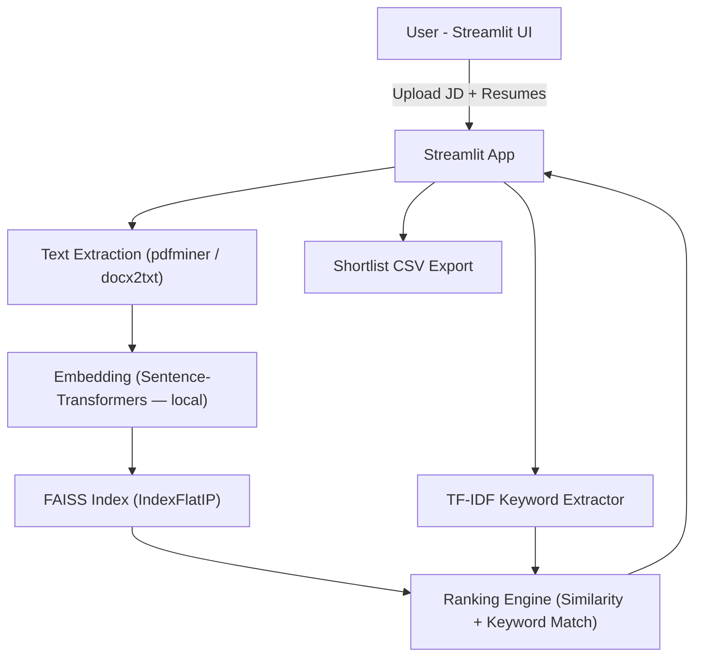

# Resume Screening Agent 

---

## Overview
**Resume Screening Agent** is a lightweight, privacy-conscious tool that ranks candidate resumes against a Job Description (JD) using **local embeddings** and **keyword-based analysis** — no paid APIs or cloud services required.

This tool is ideal for:  
- Quick, cost-free demos  
- Hackathons and prototypes  
- Privacy-sensitive environments  

---

## Key Features
- **Upload Job Description** in TXT, PDF, or DOCX format  
- **Upload multiple resumes** in TXT, PDF, or DOCX  
- **Semantic ranking** using Sentence-Transformers (`all-MiniLM-L6-v2`)  
- **Keyword extraction** via TF-IDF from the JD  
- **Rule-based explanations**: matched/missing keywords, years of experience, and seniority  
- **Export shortlist** as a CSV  
- Fully **local Streamlit UI**, no API keys required  

---

## Tech Stack
- **UI:** Streamlit  
- **Embeddings:** Sentence-Transformers (`all-MiniLM-L6-v2`)  
- **Vector search:** FAISS (IndexFlatIP)  
- **Keyword extraction:** scikit-learn TF-IDF  
- **File parsing:** pdfminer, docx2txt  
- **Programming Language:** Python 3.11  

---

## Screenshots

**Upload Job Description & Resumes**  

**Ranked Candidates with Explanations**  

> Replace placeholder images with actual app screenshots or GIFs.

---

## Installation & Usage

# Clone the repository
git clone <your-repo-url>
cd resume-screening-agent

# Create a virtual environment
python -m venv venv
# macOS/Linux
source venv/bin/activate
# Windows
venv\Scripts\activate

# Install dependencies
pip install -r requirements.txt

# Launch the Streamlit app
streamlit run app/main.py
## Quick Demo Steps
1. Paste or upload a **Job Description** (`sample_data/sample_job_desc.txt`)  
2. Upload **sample resumes** (`sample_data/resumes/`)  
3. Wait for the ranking to complete; click **Explain** to see rule-based insights for each candidate  
4. Download the **CSV shortlist** for further review  

---

## Limitations
- PDF parsing may fail for **scanned/image-only PDFs**; consider OCR as a fallback  
- Explanations are **rule-based** (TF-IDF + regex), less flexible than LLMs  
- Initial run downloads the embedding model (~50–200MB), subsequent runs are faster  

---

## Potential Improvements
- Add **OCR fallback** (Tesseract) for scanned resumes  
- Implement **resume anonymization** to reduce bias  
- Integrate a **labeled dataset** to tune ranking weights  
- Optionally, include a **local LLM** for richer explanations  

---

## Architecture

Architecture Highlights

Embeddings capture semantic similarity between JD and resumes

FAISS provides fast vector similarity search

TF-IDF extracts key JD terms for interpretable matching

Ranking Engine combines semantic similarity with keyword coverage

Streamlit UI displays rankings, explanations, and allows CSV export

Best Practices

Use anonymized resumes for fair evaluation

Adjust max_features in TF-IDF or top_k to optimize performance on slower machines

Demonstrates cost-effective, privacy-focused AI for hackathons, prototypes, or internal demos

License

MIT License — see LICENSE
